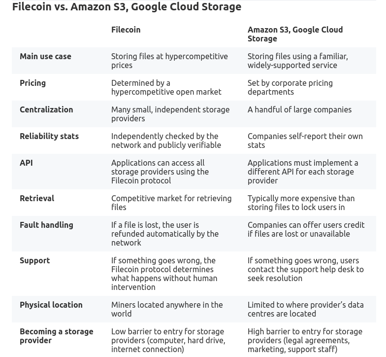
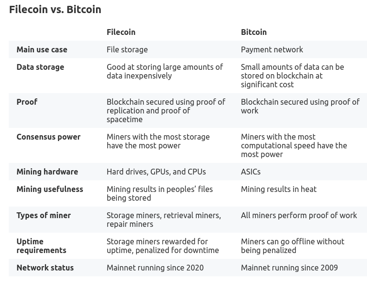
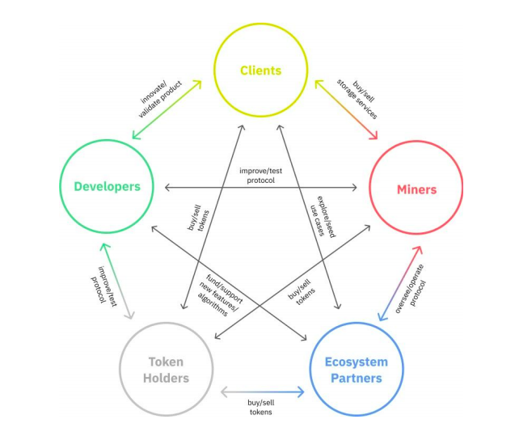

# Filecoin

> Aluna: Lívia Cereja Meinhardt 

> Curso: Ciência de Dados - FGV EMAp.

> Disciplina: Criptomoedas e aplicações na Blockchain 

[Site Oficial](https://filecoin.io/)
[White Paper](https://filecoin.io/filecoin.pdf)

## Introdução

Filecoin é uma rede de armazenamento descentralizada, cujo objetivo é "guardar as informações mais importantes da humanidade". O projeto foi desenvolvido pela Protocol Labs, como forma de resolver o problema de incentivo do Interplanetary File System IPFS, uma rede de armazenamento peer-to-peer. Baseado em uma blockchain que registra os acordos e transações feitas com o FIL, token do protocolo, a Filecoin utiliza dois mecânismos de consenso: Proof-of-Replication e Proof-of-Spacetime. O oferta inicial das moedas (ICO), em 2017, arrecadou 205 milhões do dólares. 


### Apresentação

Os slides utilizados na apresentação estão disponíveis [aqui](https://www.canva.com/design/DAEoTDievT8/a5bLDyIxP20l-0y4KigqVg/view?utm_content=DAEoTDievT8&utm_campaign=designshare&utm_medium=link&utm_source=publishsharelink)

## Protocol Labs

Protocol Labs é um laboratório de pesquisa e desenvolvimento que tem como objetivo criar uma internet rápida, segura e descentralizada. A empresa foi criada oficialmente em 2014 por Juan Benet (1998), um cientista da computação americano. No mesmo ano o white paper dos dois maiores projetos da empresa, o IPFS e a Filecoin, foram publicados.

Mais sobre o laboratório pode ser visto no [site oficial](https://protocol.ai/).

## Interplanetary File System 

### O que é

O IPFS, em português Sistema de Arquivos Interplanetário, foi primeiro projeto da Protocol Labs. Consistindo em um protocolo de [hypermedia](https://smartbear.com/learn/api-design/what-is-hypermedia/#:~:text=Unlike%20more%20traditional%20SOAP%20APIs,within%2C%20the%20HTTP%20protocol%20itself.)  peer-to-peer, o projeto propõe-se a colocar em prática o objetivo da empresa: criar uma internet rápida, segura e descentralizada. 

### Como funciona

Diferente da internet atual, em que encontramos arquivos pela sua localização - ou seja, através do endereço IP ou seu domínio, o IPFS propõe o endereçamento baseado no conteúdo. Isso é possível pois, ao adicionar um arquivo no IPFS, ele é criptografado utilizando uma função hash, além de ser identificado por uma id (chamada content identifier ou CID). Assim, quando um usuário procura pelo arquivo, a solicitação busca o nó que armazena o arquivo com aquele determinado CID.   

Além disso, quando outros usuários acessam o arquivo, são gerados caches. Desta forma, o arquivo é distribuido na rede (pelo menos até que o cache seja liberado), permitindo que o conteudo possa acessado mais rapidamente por outros usuários mais próximos daquele nó. 

Essa funcionalidade permitiria que grandes partes da internet fossem salvas em cache e acessadas mais rapidamente em outros planetas, por isso o nome do protocolo, *Sistema de Arquivos Interplanetário*. 

A utilização das hash também evitam duplicatas, o que torna a rede mais eficiente. Além disso, o IPFS suporta versionamento e, como uma nova hash será gerada, o protocolo é seguro contra censura e adulteração. 

Existem outras características interessantes do protocolo, que podem ser vistas no [site oficial](https://ipfs.io/).

Um vídeo que explica o IPFS de forma simples:

[](https://youtu.be/5Uj6uR3fp-U)

### Problemas

Apesar de todas as vantagens do sistema descentralizado, o IPFS tem um grande problema: manter os nós ativos. Caso todos os nós que armazenam um determinado arquivo fiquem offline, ou seja, sejam desligados da rede, o arquivo simplesmente se tornaria indisponível para os demais usuários. 

Esse comportameneto é, obviamente, extremamente indesejado para se manter a internet ativa, pois impossibilitaria o acesso a milhares de arquivos facilmente. Para contornar esse problema, então, foi planejado o Filecoin.

## Filecoin


### O que é

A Filecoin é uma rede peer-to-peer de armazenamento de arquivos, que conta com incentivos econômicos para garantir a permanência dos arquivos online ao longo do tempo. Esse incentivo é realizado através de recompensas, pagas com o token próprio da Filecoin, nomeado FIL. Além disso, o protocolo é complementar ao IPFS, de maneira que todos os nós da Filecoin são, essencialmente, nós IPFS. As principais diferenças e a relação entre os dois projetos pode ser entendida mais a fundo [nesse link](https://docs.filecoin.io/about-filecoin/ipfs-and-filecoin/#using-ipfs-and-filecoin).

Resumidamente, pode-se dizer que a Filecoin é um marketplace de armazenamento, em que os preços são controlados pelos envolvidos - e não pela plataforma, as trocas são feitas utilizando a própria criptomoeda, o FIL e as transações são processadas e mantidas na blockchain. Dessa forma, criou-se um serviço de armazenamento descentralizado, onde usuários podem pagar para manter seus arquivos ou disponibilizar espaço de armazenamento, que conta com uma economia bem definida, capaz de competir com serviços centralizados muito conhecidos, como o Google e a Amazon. 

Algumas funcionalidades e vantagens da Filecoin estão descritas [aqui](https://docs.filecoin.io/about-filecoin/why-filecoin/).

### Comparações

Conhecidos outros serviços de armazenamento, como citado anteriormente, Google e Amazon, a documentação da Filecoin faz a seguinte comparação:



## Como Funciona: Armazenar

Para entender as etapas seguidas por um usuário que deseja armazenar seus dados na rede Filecoin, o fluxograma abaixo pode ser consultado:


Primeiramente, o cliente que deseja armazenar dados na rede Filecoin pode utilizar softwares para se conectar com a rede. Alguns exmplos de aplicativos, listados [aqui](https://docs.filecoin.io/store/), são: 

- [ChainSafe Files](https://files.chainsafe.io/)
- [Estuary](https://estuary.tech/)
- [Space Storage](https://space.storage/)
- [Web3.Storage](https://web3.storage/)


Além disso, pode-se usar o [Lotus](https://github.com/filecoin-project/lotus), uma implementação do Filecoin, desenvolvida em Go, que permite gerenciar acordos realizados - importar, armazenar e recuperar os dados na rede. 

Também é interessante consultar:

- [Slate](https://docs.filecoin.io/store/slate/)
- [Starling](https://docs.filecoin.io/store/starling/)
- [Estuary](https://docs.filecoin.io/store/estuary/)

*OBS: as demais etapas do fluxograma apresentado são discutidas nas próximas seções*

### Outros incentivos: Slingshot

Um dos grandes objetivos do Filecoin é "armazenar as informações mais importantes da humanidade". Como uma forma de incentivar a participação da comunidade, de forma a tornar isso possível, criou-se o
Slingshot. Essa competicação propoẽ que os participantes armazenem conjuntos de dados na rede Filecoin, tornando-os acessíveis e exploráveis para o mundo todo. Dessa forma, também, desenvolvedores e clientes podem colaborar para a melhoria da rede, além de aumentar a comunidade do projeto.

Veja mais sobre no [site oficial](https://slingshot.filecoin.io/)

## Privacidade

Como já mencionado, um dos objetivos da Protocol Labs e, assim, da Filecoin é criar uma alterantiva aos serviços centralizados, que facilitam, entre outras coisas, a censura. Desta forma, e somado a natureza dos serviços descentralizados, as informações e os dados armazenados na rede são protegidos e privados.

A respeito das transações e uso do serviço, no caso em que é feita utilizando o [Lotus](https://docs.filecoin.io/store/lotus/), o gerenciamento é feito via via console e não é necessário cadastrar mais informações do que a chave de sua carteira. Sendo assim, a Filecoin é uma criptomoeda que oferece privacidade e anonimidade. Outras aplicações, mencionadas anteriormente, podem ter outras políticas. 

## Nodes

A rede Filecoin é constituida por *peers*, que se comunicam por canais seguros, distribuindo informação (veja [*gossip protocol*](https://en.wikipedia.org/wiki/Gossip_protocol)), transferindo dados e descobrindo outros *peers* na rede. 

Os *nós* da rede são *peers* sincronizados com a blockchain que validam as mensagens (dados) dos blocos (veja [Broadcasting](https://en.wikipedia.org/wiki/Broadcasting_(networking))), propondo acordos de armazenamento ou recuperação com mineradores, por exemplo. Há várias implementações e tipos para os nós da Filecoin. 

Mais informações sobre os nós estão disponíveis [na Spec](https://spec.filecoin.io/#section-systems.filecoin_nodes).

## Blockchain

A Blockchain da Filecoin é uma máquina virtual distribuida que funciona como a interface principal para os vários [atores](https://spec.filecoin.io/#section-systems.filecoin_vm.sysactors) do sistema Filecoin. Como citado anteriormente, os nós da Filecoin são nós do IPFS. Assim, a blockchain não armazena nenhum arquivo compartilhado na rede, mas sim os acordos, transações, mensagens, provas de consenso e carteiras. 

### Blocos 

A unidade principal da Blockchain, os blocos tem a seguinte escrutura (na implementação do Lotus):

```go
type FullBlock struct {
	Header        *BlockHeader
	BlsMessages   []*Message
	SecpkMessages []*SignedMessage
}
```

Que contém:

- Block Header: representação canônica do bloco, são propagados entre os mineradores, distribuindo as informações necessárias para atualizar a cadeia
- A lista de mensagens do bloco: descrevem as mudanças que devem ser aplicadas para alcançar um estado deterministico da cadeia
- As assinaturas das mensagens

A estrutura de um Block Header:


```go
type BlockHeader struct {
	Miner                 address.Address    // 0 unique per block/miner
	Ticket                *Ticket            // 1 unique per block/miner: should be a valid VRF
	ElectionProof         *ElectionProof     // 2 unique per block/miner: should be a valid VRF
	BeaconEntries         []BeaconEntry      // 3 identical for all blocks in same tipset
	WinPoStProof          []proof2.PoStProof // 4 unique per block/miner
	Parents               []cid.Cid          // 5 identical for all blocks in same tipset
	ParentWeight          BigInt             // 6 identical for all blocks in same tipset
	Height                abi.ChainEpoch     // 7 identical for all blocks in same tipset
	ParentStateRoot       cid.Cid            // 8 identical for all blocks in same tipset
	ParentMessageReceipts cid.Cid            // 9 identical for all blocks in same tipset
	Messages              cid.Cid            // 10 unique per block
	BLSAggregate          *crypto.Signature  // 11 unique per block: aggrregate of BLS messages from above
	Timestamp             uint64             // 12 identical for all blocks in same tipset / hard-tied to the value of Height above
	BlockSig              *crypto.Signature  // 13 unique per block/miner: miner signature
	ForkSignaling         uint64             // 14 currently unused/undefined
	ParentBaseFee         abi.TokenAmount    // 15 identical for all blocks in same tipset: the base fee after executing parent tipset

	validated bool // internal, true if the signature has been validated
}
```

*Mais detalhes sobre a blockchain, blocos e estruturas estão disponíveis no [Spec](https://spec.filecoin.io/#section-systems.filecoin_blockchain), referência principal deste trecho.*

O mecanismo de consenso usado pela Blockchain é baseado na *Prova de Armazenamento* - também utilizado por outras blockchains de projetos de armazenamento, como a [Storj](https://www.storj.io/) - em que os mineradores devem provar que possuem uma cópia dos dados em um determinado período de tempo. Ou seja, devem provar que estão cumprindo o contrato. Para isso, o sistema disponibiliza "desafios" que fazem referência a uma parte aleatória do dado, em um intervalo de tempo em que é impossível ou desvantagem para o minerador descartar os dados e depois recuperá-los, somente quando desafiado pela rede. 

Assim, diferentemente de outras criptomoedas, que tem suas provas baseadas em esforço computacional, a blockchain da Filecoin utiliza a *Proof of Replication* e a *Proof of Spacetime*, descritas abaixo. Desta forma, os mineradores com maior espaço de armazenamento são os que possuem mais poder de consenso. 

Antes de apresentar os dois tipos de prova de armazenamento citados, é válido ressaltar que estas devem garantir que 3 tipos de ataques não afetem a rede, são estes:

- [Ataque Sybil](https://academy.binance.com/pt/articles/sybil-attacks-explained): em que o dado é armazenado apenas uma vez enquanto o minerador cria múltiplas identidades Sybil, de forma que sejam computadas mais cópias
  
- Ataque Outsourcingem: em que o minerador afirma que armazema mais dados do ele fisicamente é capaz, buscando os dados de outros quando necessário

- Ataque Generation: em que o minerador alega armazenar uma grande quantidade de dados, que na verdade são gerados *on-demand* por um programa.

*Esses ataques poderiam ser interessantes para o mineradores uma vez que a chance de receber uma recompensa do bloco é proporcional ao espaço de armazenamento fornecido por ele à rede, como será explicado a frente*

### Proof of Replication

Esse mecanismo é um tipo de *Proof-of-Storage* que permite que um servidor (*"provador" P*) prove a um usuário (*verficador V)* que um *dado D* foi replicado para sua própria unidade física dedicada. O protocolo funciona nas etapas em que *P*:

1. Se se compromete a armazenar n replicas distinras do dado D
2. Prova para V que está armazenando cada replica via autenticação desafio-resposta

O protocolo é caracterizado por uma tupla de algoritmos com tempo de execução polinomial:

                                        (Setup, Prove, Verify)

- *PoRep.Setup(1λ, D) → R, SP , SV , where SP and SV are scheme-specific setup variables for P and V, λ is a security parameter. PoRep.Setup is used to generate a replica R, and give P and V the necessary information to run PoRep.Prove and PoRep.Verify. Some schemes may require the prover or interaction with a third party to compute PoRep.Setup.*

- *PoRep.Prove(SP , R, c) → πc, where c is a random challenge issued by a verifier V, and πc is a proof that a prover has access to R a specific replica of D. PoRep.Prove is run by P to produce a πc for V.*

- *PoRep.Verify(SV , c, πc) → {0, 1}, which checks whether a proof is correct. PoRep.Verify is run by V and convinces V whether P has been storing R.*

Disponível em: [Filecoin White Paper](https://filecoin.io/filecoin.pdf); Cap 3.2

### Proof of Spacetime

O *Proof of Spacetime* surge da necessidade de provar a permanência do dado durante todo o período de tempo acordado no contrato. Uma vez que a *Proof of Replication* garante que o dado foi replicado, mas não considera um período de tempo distindo daquele em que o desafio é solicitado.

Porém, para evitar gargalos não deve-se repetir o desafio a cada minuto para o conjunto de dados, por exemplo. Daí, define-se o *Proof of Spacetime*:

Para *P* provar a *V* que está armazenando *D* no tempo *t*, o protocolo é caracterizado por uma tupla de algoritmos com tempo de execução polinomial, semelhante ao consenso anterior, mas considerando o tempo *t*:

                                        (Setup, Prove, Verify)

em que, 

- *PoSt.Setup(1λ, D) → SP , SV , where SP and SV are scheme-specific setup variables for P and V, λ is a security parameter. PoSt.Setup is used to give P and V the necessary information to run PoSt.Prove and PoSt.Verify. Some schemes may require the prover or interaction with a third party to compute PoSt.Setup.*

- *PoSt.Prove(SP , D, c, t) → πc, where c is a random challenge issued by a verifier V, and πc is a proof that a prover has access to D for some time t. PoSt.Prove is run by P to produce a πc for V.*

- *PoSt.Verify(SV , c, t, πc) → {0, 1}, which checks whether a proof is correct. PoSt.Verify is run by V and convinces V whether P has been storing D for some time t.*

Disponível em: [Filecoin White Paper](https://filecoin.io/filecoin.pdf); Cap 3.3

## Hash

É utilizada uma função hash resistente a colisão CRH e uma MerkleCRH, que constrói uma árvore binária e aplica o CRH recurssivamente. Para as assinaturas, o hash é feito com o [blake2b](https://www.blake2.net/), de forma a se obter um output de 256 bit.

## Escalabilidade 

Uma transação financeira leva em média 1 *blocktime*, isto é, cerca de 30 segundos para ser refletida na rede. 

Transações podem ser acompanhadas pelo [BscScan](https://bscscan.com/token/0x0d8ce2a99bb6e3b7db580ed848240e4a0f9ae153) ou pela [Filox](https://filfox.info/en)

Mais informações sobre performace da rede [aqui](https://docs.filecoin.io/about-filecoin/network-performance/#financial-transfers)

*Obs: não encontrei informações do número de transações por minuto atual para comparação*

## Mineração

Na Filecoin os mineradores contribuem com a quantidade de armazenamento fornecida à rede e não com poder computacional, como em outras criptomoedas - que utilizam *proof-of-work*, por exemplo. 

Como demosntrado no esquema, em alto nível, existem dois processos realizados por mineradores, que configuram dois tipos diferentes deste usuário: 

1. **Armazenamento**: armazenam os dados dos clientes e computam as provas criptográficas necessárias; A probabilidade de ganharem recompensas dos blocos e taxas de transações é proporcional a quantidade de armazenamento disponibilizada;
   
2. **Recuperação**: recuperam os dados dos clientes na rede; Ganham FIL vencendo lances e pelas taxas de mineração de um arquivo. Assim, sua velocidade de sua banda determina quandos acordos consegue fechar.

Há, ainda, um terceiro tipo de minerador sendo desenvolvido, chamaos *Repair miners*.

### Recompensas e *Slashing*

Como já mencionado, os mineradores ganham o direito de minerar um bloco - e assim,  obter recompensas do bloco e recolher as taxas das mensagens incluidas nele - proporcionalmente a contribuição de espaço que faz a rede da Filecoin.  

Além disso, os mineradores ganham FIL pelos contratos fechados com clientes, ao submeter provas corretas à blockchain. Porém, caso falhem em submeter a prova (ou tenham alguma ação maliciosa no sistema), os mineradores sofrem penalidades. 

Se, por exemplo, um minerador falha em submeter a *Prova de Spacetime* as multas são aplicadas diariamente, enquanto ele ainda estiver offline, até que sua carteira esteja vazia. Existem dois tipos de penalidades:

1. *Consensus Fault Slash*
2. *Storage Fault Slashing*

*As penalidades são melhores descritas no [Spec](https://spec.filecoin.io/#section-glossary.fault)*

### Requisitos

Para se tornar um minerador, os requisitos de hardware são:

- CPU: 8+ core 
- RAM: 128 Gib + 256 Gib of swap on NVMe SSD
- [GPU](https://github.com/filecoin-project/bellperson#supported--tested-cards)
- Disco: 1TiB NVMe

Mais informações disponíveis na [documentação](https://docs.filecoin.io/mine/hardware-requirements/#specific-operation-requirements).

## Interoperabilidade

A blockchain da Filecoin foi projetada de forma a armazenar grandes quantidades de dados. Assim, um de seus objetivos é armazenar, inclusive, transações de outras blockchains, ou seja, interoperando essas transações.
Além disso, como explicado o Filecoin interopera diretamente com o IPFS. A amplicação dessa funcionalidade está em construção. Como exemplo disso, pode-se ler sobre a relação da Filecoin e o Etherium [neste artigo](https://filecoin.io/blog/posts/bridging-the-filecoin-and-ethereum-communities/). Além disso, a Filecoin e a [Hedera Hashgraph](https://hedera.com/blog/filecoin-and-hedera-hashgraph-announce-grant-program-to-propel-web3-interoperability) também estão unindo esforços para a interoperabilidade da Web3.

## Comparação: Filecoin e Bitcoin

Para uma melhor visualização dos diferenciais do Filecoin, a [documentação oficial](https://docs.filecoin.io/about-filecoin/filecoin-compared-to/#filecoin-vs-bitcoin) apresenta uma comparação entre ela e o Bitcoin:



## Economia

A descrição completa da economia da Filecoin é descrita [neste documento](https://filecoin.io/2020-engineering-filecoins-economy-en.pdf). Este documento descreve toda a economia, além de apresentar vários diagramas, fluxogramas e gráficos para um entendimento visual do projeto.

Por exemplo, o diagrama abaixo demonstra as interações dos diversos participantes dessa economia:



### Baseline 

Para inserir novas moedas a rede, o sistema de recompensas dos blocos não leva em consideração somente o tempo - ou seja, não utiliza apenas o modelo exponencial, como outras criptomoedas. Ao invés disso, a Filecoin faz com que as recompensas aumentam conforme a capacidade de armazenamento total da rede aumenta. Nesse modelo, a Filecoin recompensa os mineradores proporcionalmente à utilidade que eles tem para a rede e, consequentemente, para os clientes. 

No sistema final, um modelo hídrido é utilizado. Ou seja, parte do sistema de recompensas utiliza o *"Simple Minting"* (30%) e outra parte o *"Baseline Minting"* (70%).

### Alocação dos Tokens

O Filecoin tem um máximo de 2.000.000.000 tokens a serem criados. A alocação destes tokens é feita da seguinte maneira:


em que:

- *Storage Mining allocation*: parte alocada para a mineração de armazenamento;
  
- *Mining Reserve*: parte alocada para outros tipos de mineração (como a de recuperação e outras a serem implementadas);
  
- *Fundraising*: em que 7.5% foram alocados para o [ICO em 2017](https://www.coindesk.com/markets/2017/09/07/257-million-filecoin-breaks-all-time-record-for-ico-funding/) e 2.5% para outros usos, com o desenvolvimento do ecossistema da Filecoin;

e os demais foram alocados para a Protocol Labs (o que inclui PL team & contributors) e a e Filecoin Foundation.

### Queima de Tokens

O FIL é uma criptomoeda deflacionaria. Esse fenômeno deve-se à queima de tokens para cálculos em cadeia e largura de banda, além da queima realizada na aplicação de penalidades - descritas anteriormente. 

## Referências

Esse documento é altamente baseado nos documentos oficiais da filecoin. ALém disso outras referências foram utilizadas para melhor entendimento. Todas as fontes estão apresentadas a seguir:

1. [*Spec*](https://spec.filecoin.io/)

2. [Site Oficial](https://filecoin.io/) 

3. [Documentação](https://docs.filecoin.io) 

4. [White Paper](https://filecoin.io/filecoin.pdf) 

5. [Proof of Spacetime](https://coinmarketcap.com/alexandria/glossary/proof-of-spacetime) 

6. [Proof-of-Replication](https://coinmarketcap.com/alexandria/glossary/proof-of-replication) 

7. [IPFS Resumido](https://www.youtube.com/watch?v=5Uj6uR3fp-U) 

8. [Filecoin Visão Geral](https://www.youtube.com/watch?v=I_g6PPWG5P0&t=808s) 

9. [Economia](https://filecoin.io/2020-engineering-filecoins-economy-en.pdf) 

