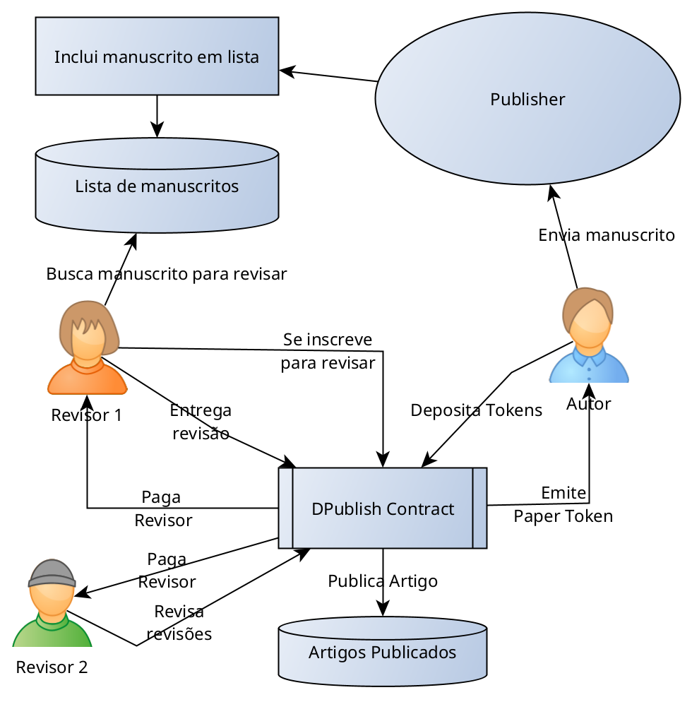

# Segunda Avaliação

Para a segunda avaliaçao do curso, iremos desenvolver um sistema de publicação distrubuída baseado no modelo apresentado [neste artigo](https://www.scielo.br/j/mioc/a/pGbLcFHfhKGvXvTYPcGrfWw/?lang=en). Este projeto será uma DAO ([decentralized autonomous organization](https://ethereum.org/en/dao/)). Vamos chamá-lo de **DAPH**, decentralized autonomous Publishing house.

Leia o artigo para entender o conceito proposto.

Sugestão de Fluxograma:

## Requisitos essenciais
O projeto envolverá o desenvolvimento de smart-contracts conforme explicitado neste documento. O projeto deve ser gerenciado por uma das duas framework de desenvolvimento de smart-contracts: [Truffle](https://www.trufflesuite.com/docs/truffle/getting-started/creating-a-project) ou [Brownie](https://eth-brownie.readthedocs.io/en/latest/index.html), à escolha do aluno.

Os contratos devem ser desenvolvidos a partir de templates disponíbilizados pelo projeto [Open Zeppelin](https://github.com/openzeppelin/openzeppelin-contracts). 

1. **DPub token** contrato para criação de tokens no padrão [ERC777](https://docs.openzeppelin.com/contracts/4.x/erc777) que serão utilizados para a remuneração das tarefas na *DAPH*.
1. **Review token** Contrato para criação de token não-fungível padrão [ERC721](https://docs.openzeppelin.com/contracts/4.x/erc721) que fará o papel de certificado de revisão.
1. **Paper token** Outro Token ERC721 para registrar publicações já aceitas pelos revisores.
1. Opcionalmente Pode ser utilizado um contrato [ERC1155](https://docs.openzeppelin.com/contracts/4.x/erc1155) para gerir todos os tokens a partir de um único contrato.
1. **Contrato de Governança para a DAPH** Contrato que definirá a API que representa o workflow de todo o sistema de publicação.

## Bonus
Desenvolver um frontend web para o seu projeto.

## Entrega do projeto

Todos os projetos deverão ser construídos a partir do template mínimo disponível [neste repositório](https://github.com/fccoelho/Dpublish). Todos os alunos deverão criar um fork pessoal deste repo. A entrega será na forma de um pull-request para o repositório original.
