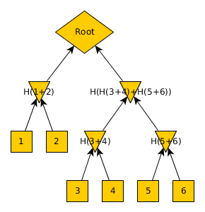

# Enrich the functionalities of database using a merkle tree

In this assignment you will take your previous implementation of a Merkle tree and use it to enhance the functionalities of a standard database. By calculating the Merkle tree of database records, you can detect modifications. add a basic querying interface on top of it. The goal is to be able to be able to encode the records of a data table, into a merkle-tree So they can be verified as accurate but also so that we can use [merkle proofs](https://bitcoin.stackexchange.com/questions/69018/merkle-root-and-merkle-proofs) to validated that a restricted subset of the records is part of the public subset of the data. 

So suppose in the figure below, leaves 1 and 2 are private while the remaining leaves can be viewed publicly.

In the figure above, triangles are branch roots, which means they can replace their branches since a simple merke proof can demonstrate that together with the rest of the data, it comprise the full record.

Branch roots can be used also to filter or group records by.

Basic queries which should be present are:

- Select
- group by
- filter

