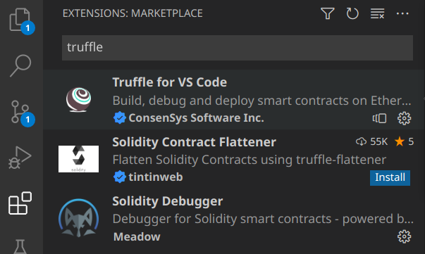
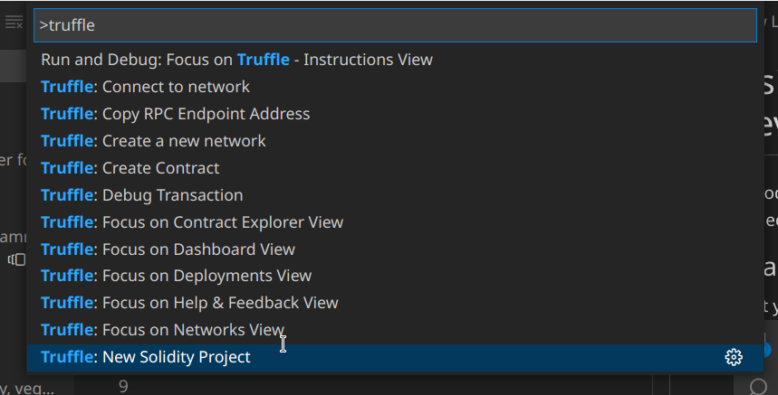

# Using VSCode for Solidity development
VSCode now has an official plugin to manage [Truffle](https://trufflesuite.com) projects.
## Loading the Truffle extension
First you have to install the Truffle extension


## Installing the Truffle Suite
If you have `npm` installed on you computer, you can install truffle with the following command:

```bash
npm install -g truffle
```

You also need to install Ganache, which you can [download from here](https://github.com/trufflesuite/ganache/releases).

## Creating a new Project
The next step is to create a new Truffle project from within VSCode.

hit `ctrl+shit+P` from within VSCode and choose `Truffle: New Solidity Project`

