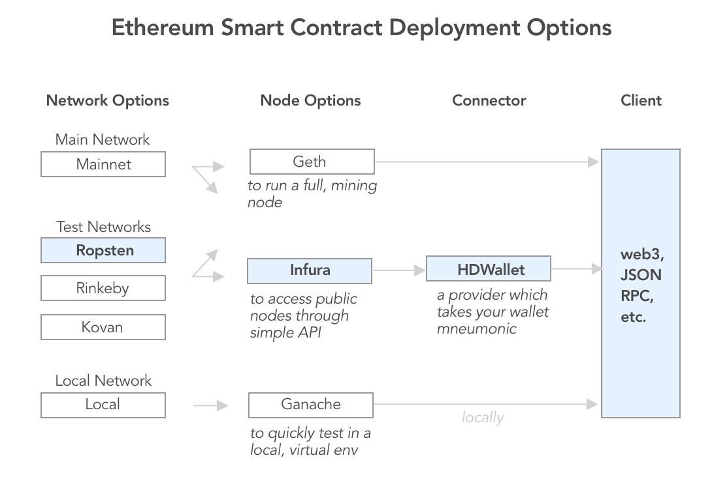

# Build your own ICO

ICOs (Initial Coin Offerings) are (still) a dominating phenomenon in the smart-contract world.
 A full ICO is much more than software development, depending for its success on a soud business model behind it and lots of marketing.
 
 An ICO is basically a *crowdsale* of special-purpose tokens usually conducted to raise capital for a business.  There are other reasons to create a tokes, of course but most ICOs aim at raising funds. In any case, no matter the purpose of your token If it does not get sold, it remains useless. So the content of this lecture is relevant for a wide variety of ICOs.
 
 ## The contracts
An ICO needs at least two contracts: *the token contract* and a *crowdsale* contract to sell the tokens.
For this exercise we will use a basic ERC20 contract whichwe have already studied on a [previous lecture](Lecture%205%20-%20token-contracts.md).

We will also develop a crowdsale contract and for that we will start from the template [made available](https://github.com/OpenZeppelin/openzeppelin-solidity/blob/master/contracts/crowdsale/Crowdsale.sol) from the OpenZeppelin project. 

## Setting up the project
For this project we will use the Truffle framework. We will work step-by-step here in this setup, however if you wish to learn more please check out [this video](https://www.youtube.com/watch?v=Zwc98_AvQ2Y).

First let's install the basic software. I'll assume that if you are following this course you will already have installed nodejs and Ganache on your computer. If you have not, please follow the instructions on [this lecture](Lecture%204%20-%20Solidity%20development%20environment.md).

the following command will install Truffle:
```bash
npm install -g truffle
```
depending on how you installed *node* you may need to run the command above as *root* or with *sudo*. Then you can install the OpenZeppelin library.
First you create the project directory.
```bash
mkdir ICO
cd ICO
truffle init
``` 
Then in order to install the latest version of Openzeppelin library, do:
```bash
npm init -y 
npm install --save-exact openzeppelin-solidity@next
```

`npm init -y` initializes the `package.json` file:

```json
{
  "name": "ICO",
  "version": "1.0.0",
  "description": "",
  "main": "truffle-config.js",
  "directories": {
    "test": "test"
  },
  "dependencies": {
    "openzeppelin-solidity": "^1.12.0"
  },
  "devDependencies": {},
  "scripts": {
    "test": "echo \"Error: no test specified\" && exit 1"
  },
  "keywords": [],
  "author": "",
  "license": "ISC"
}
```

This file contains metadata about the package and also declares dependencies of your package. Note that a `node_modules` directory is also create at the root of your project directory. this is where libraries needed by your project will reside. Do not fiddle with the contents of this directory. It will be managed by `npm`.

## Contract development
Once You have setup you environment the next thing to do is to start familiarizing yourself with the truffle framework. The best way to do this is by getting your hands dirty in Solidity development and compilation.

As suggested above we can start from the [ERC20 template](https://github.com/OpenZeppelin/openzeppelin-solidity/blob/master/contracts/token/ERC20/ERC20.sol) from Openzeppelin as our token and with the [crowdsale contract](https://github.com/OpenZeppelin/openzeppelin-solidity/blob/master/contracts/crowdsale/Crowdsale.sol) to run the token sale. Copy those templates to the `contracts` directory of your project. 

For our little tutorial, we have [customized them](https://github.com/fccoelho/ICO-playground/tree/2018_project/FunnyToken/contracts) somewhat.

Once you have done that, you are ready to do your first contract compilation using `Truffle`:
```bash
truffle compile
```
If everything comes out ok you should immediately add some tests to your project's contracts. Tests are important as they define the desired functionality of contracts. And help us to keep our contracts safe and valid as we tweek them with new features.

### Testing you contracts
Since we are starting from the templates took from the Openzeppelin solidity project, we can also benefit from the tests they already wrote for them. If look through their [test collection](https://github.com/OpenZeppelin/openzeppelin-solidity/tree/master/test), we can copy two test scripts to our project's test directory: `ERC20.test.sol` and `crowdsale.test.js`. But we will need to modify them to conform our own slightly customized contracts. The crowsale tests will look like this:
```javascript
const { assertRevert } = require('../node_modules/openzeppelin-solidity/test/helpers/assertRevert');
const { ether } = require('../node_modules/openzeppelin-solidity/test/helpers/ether');
const { ethGetBalance } = require('../node_modules/openzeppelin-solidity/test/helpers/web3');

const BigNumber = web3.BigNumber;

const should = require('chai')
  .use(require('chai-bignumber')(BigNumber))
  .should();

const TokenSale = artifacts.require('TokenSale');
const FunnyToken = artifacts.require('FunnyToken');

contract('TokenSale', function ([_, investor, wallet, purchaser]) {
  const rate = new BigNumber(1);
  const value = 10;//ether(42);
  const tokenSupply = new BigNumber('1e18');
  const expectedTokenAmount = rate.mul(value);
  const ZERO_ADDRESS = '0x0000000000000000000000000000000000000000';

  it('requires a non-null token', async function () {
    await assertRevert(
      TokenSale.new(rate, wallet, ZERO_ADDRESS)
    );
  });

  context('with token', async function () {
    beforeEach(async function () {
      this.token = await FunnyToken.new();
    });

    it('requires a non-zero rate', async function () {
      await assertRevert(
        TokenSale.new(0, wallet, this.token.address)
      );
    });

    it('requires a non-null wallet', async function () {
      await assertRevert(
        TokenSale.new(rate, ZERO_ADDRESS, this.token.address)
      );
    });

    context('once deployed', async function () {
      beforeEach(async function () {
        this.tokensale = await TokenSale.new(rate, wallet, this.token.address);
        await this.token.transfer(this.tokensale.address, tokenSupply);
      });

      describe('accepting payments', function () {
        describe('bare payments', function () {
          it('should accept payments', async function () {
            await this.tokensale.send(value, { from: purchaser, gas: 220000 });
          });

          it('reverts on zero-valued payments', async function () {
            await assertRevert(
              this.tokensale.send(0, { from: purchaser })
            );
          });
        });

        describe('buyTokens', function () {
          it('should accept payments', async function () {
            await this.tokensale.buyTokens(investor, { value: value, from: purchaser, gas:220000 });
          });

          it('reverts on zero-valued payments', async function () {
            await assertRevert(
              this.tokensale.buyTokens(investor, { value: 0, from: purchaser, gas:220000 })
            );
          });

          it('requires a non-null beneficiary', async function () {
            await assertRevert(
              this.tokensale.buyTokens(ZERO_ADDRESS, { value: value, from: purchaser, gas:220000 })
            );
          });
        });
      });

      describe('high-level purchase', function () {
        it('should log purchase', async function () {
          const { logs } = await this.tokensale.sendTransaction({ value: value, from: investor, gas:220000 });
          const event = logs.find(e => e.event === 'TokensPurchased');
          should.exist(event);
          event.args.purchaser.should.equal(investor);
          event.args.beneficiary.should.equal(investor);
          event.args.value.should.be.bignumber.equal(value);
          event.args.amount.should.be.bignumber.equal(expectedTokenAmount);
        });

        it('should assign tokens to sender', async function () {
          await this.tokensale.sendTransaction({ value: value, from: investor, gas:220000 });
          (await this.token.balanceOf(investor)).should.be.bignumber.equal(expectedTokenAmount);
        });

        it('should forward funds to wallet', async function () {
          const pre = await ethGetBalance(wallet);
          await this.tokensale.sendTransaction({ value, from: investor, gas: 220000 });
          const post = await ethGetBalance(wallet);
          post.minus(pre).should.be.bignumber.equal(value);
        });
      });

      describe('low-level purchase', function () {
        it('should log purchase', async function () {
          const { logs } = await this.tokensale.buyTokens(investor, { value: value, from: purchaser, gas:220000 });
          const event = logs.find(e => e.event === 'TokensPurchased');
          should.exist(event);
          event.args.purchaser.should.equal(purchaser);
          event.args.beneficiary.should.equal(investor);
          event.args.value.should.be.bignumber.equal(value);
          event.args.amount.should.be.bignumber.equal(expectedTokenAmount);
        });

        it('should assign tokens to beneficiary', async function () {
          await this.tokensale.buyTokens(investor, { value, from: purchaser, gas:220000 });
          (await this.token.balanceOf(investor)).should.be.bignumber.equal(expectedTokenAmount);
        });

        it('should forward funds to wallet', async function () {
          const pre = await ethGetBalance(wallet);
          await this.tokensale.buyTokens(investor, { value, from: purchaser , gas:220000});
          const post = await ethGetBalance(wallet);
          post.minus(pre).should.be.bignumber.equal(value);
        });
      });
    });
  });
});
```
The code above should be taken as a starting point. Study it until you are sure you understand all of its logic. The go ahead and evolve you contract and testing code in parallel. Remember to follow the TDD (test driven development) philosophy, and write your tests before you implement a new feature in your contract. Never let your tests get out of synch with your solidity code, because it can be very difficult find bug in contracts without good test coverage. Code in solidity is not easy to debug, so having abundant tests is you best tool to maintain code quality.

## Interacting with your contracts from the Truffle console

Once all your tests are passing and you are satisfied with the status of your contract(s), try as much as possible to interact with it from the `truffle console`. it will give you a better feel for its usability and will help you to have Ideas for the frontend of your ICO. First make sure you have deployed your contracts to the ganache-cli private blockchain by running `truffle migrate --network ganache`.

```bash
$ truffle console --network ganache
```
Once You are in the console, there are a number of things you can do. Basically you have at your disposal the [Web3 APIs](https://web3js.readthedocs.io/en/1.0/). For example we can start by listing the existing accounts so that we can use them when interacting with contracts. 

```javascript
truffle(ganache)> web3.eth.accounts
[ '0x125efe506d1ab551ca7a54d06c094a61372bf0d3',
  '0x9ebdc13306223334f346f38d76abc0b6c033618b',
  '0xd87fadd4817d0a24a6e2bae34cabac16b302d7c1',
  '0x43db49aaa397e67500468750e4ba2d81780e6fb2',
  '0x42ec67ffa37c6637f8e3a26ff49096c96f14dda5',
  '0x05bb580560ffb5772f2796bdfb9c13f283268d1a',
  '0x1c6caeea77c1bd25a4325a95cde9ce0ff9f1266a',
  '0x408ec8f87b41d03cf68cf293ddf66ae7a9b9a888',
  '0xe19a3df16797bbc3288ce283f2127b3223407cc8',
  '0xebfc14b4e10c118b9c8294ed0431c5bfc6e49f68' ]
```
You may also want to check the balance of Ether on one of these addresses:
```javascript
truffle(ganache)> web3.eth.getBalance('0x1c6caeea77c1bd25a4325a95cde9ce0ff9f1266a')
BigNumber { s: 1, e: 20, c: [ 1000000 ] }
truffle(ganache)> web3.eth.getBalance('0x1c6caeea77c1bd25a4325a95cde9ce0ff9f1266a').toNumber()
100000000000000000000
```
Note that balances are given in units of `wei`, so the value above corresponds to a 100 Ethers (remember that 1 Ether=10**18 Wei)

To get hold of an instance of our deployed contracts we can do this:
```javascript
truffle(ganache)> FunnyToken.deployed().then(instance => token = instance)
truffle(ganache)> token.address
'0x0a4b4c72ef0404f177e3e2b73cf38e4f5d8b87cb'
truffle(ganache)> token.balanceOf('0x1c6caeea77c1bd25a4325a95cde9ce0ff9f1266a')
BigNumber { s: 1, e: 0, c: [ 0 ] }
```

As seen above from the deployed instance of the contract, can interact with it freely. Hitting \<TAB> after a dot, allows us to introspect the object to see what functions or attributes can be invoked.

One interesting task to perform in this initial interactions with our ICO contracts, is to use the `TokenSale` contract to buy tokens. For that we need to get a hold of an instance of that contract. we'll do that the same way we did for the `FunnyToken` contract.

```javascript
truffle(ganache)> TokenSale.deployed().then(instance => sale = instance)
```

But in order to know what to expect, we need to understand how the conversion rate between Ether and our token works. We already know the the smallest unit of Ether is the Wei and that `1 Eth = 10^18 Wei`, now we have to remember that the same will apply to our token. So if we call its smallest subdivision, say, a `laugh`, then for every Funny we will have `10^(decimals) laughs` or `10^18 laughs`. So for example we want to set the price of a Funny token to 1 Ether, since we have the same subdivision, the rate will be 1. For a more detailed explanation [read this](https://openzeppelin.org/api/docs/learn-about-crowdsales.html).

## Deploying to a Live network
The first challenge we have to face when moving into this phase of the project is setting up a connection with a live ethereum testnet. Yes, there are more than one to choose from. and your choice will depend on [a number of factors](https://web3py.readthedocs.io/en/stable/node.html?highlight=infura).



We already are familiar with the ganache local blockchain and the workflow to deploy on a Live testnet wont be much different. We will work with the choices highlighted in the figure above.

One of the main differences from the way we worked so far, is that now we will have to setup a wallet manually instead of having our Ethereun node create it for us. For that, we will use [Metamask](https://metamask.io/). Metamask is a browser extension which will serve as a wallet for this purpose. 

The second step is to [obtain ether] for our transactions. Since we are on a testnet, we can get ether from the so-called Faucets, which are websites which distribute test ethers to anyone who needs some. Metamask runs their own [faucet](https://faucet.metamask.io/). Go there (after having setup your wallet with metamask) and get some ether. 

The third step will be to go to [Infura](https://infura.io) and get ourselves an [API key](https://infura.io/docs/gettingStarted/chooseaNetwork) for the Ropsten network.  

Once you complete these three steps, it's time to begin modifying our code to enable deplyment to the `Ropsten` testnet.

The first thing we will need is to install an additional truffle package to interact with the Metamask wallet.

```bash
$ npm install truffle-hdwallet-provider
```

Then we can proceed to create an entry for the `Ropstein` network in our `truffle.js` file

```javascript
var HDWalletProvider = require("truffle-hdwallet-provider");
var infura_apikey = "Your Infura key here"; // Get yours at https://infura.io/signup. It's free.
var mnemonic = "<REPLACE THIS WITH YOUR METAMASK SEED PHRASES>";

module.exports = {
  networks: {
    development: {
      host: "localhost",
      port: 8545,
      gas: 6500000,
      network_id: "*"
    },
    ropsten:  {
      provider: new HDWalletProvider(mnemonic, "https://ropsten.infura.io/" + infura_apikey),
      network_id: 3,
      gas: 4500000
    }
  }
};
```
You are now ready to deploy to `Ropsten`. Make sure you have ether on your wallet, and try:

```bash
$ truffle migrate --network ropsten
```
After a while, you will see output in your terminal very similar to the one you got in the local network.
It takes a while because now you are reaching out to a remote node, and you have to wait for the transactions to be mined before you get back the address of the contracts published.
You should take notice of the addresses, so that you can find and interact with them later. But this information is also saved in the contract artifacts in the build directory.

Now You can run the tests in `Ropsten`, but be aware that they will cost you Ether (fake Ether, but still you should have enough on your wallet)). Another alternative is to open a truffle console directly on the ropstein network.

```bash
$ truffle console --network ropsten
```

But The easiest way to test the contract is to send it one Ether and see if the sale works. How? just open Metamask and send the Ether to the sale address you wrote down after the deployment.

To check on you token balance, just go to Metamask, select `Tokens` , `add Token` and paster the Token contract address.
You should now see your FunnyToken balance. 

## Deploying The frontend(s)
Now that we have our contracts running live in *the wild*, All we need is to deploy our frontend web apps to help non-techies interact with our token sale and start buying our tokens. The technical steps required to adapt our web apps to the new contracts will be described in the respective lectures for the [Python](Lecture 7 - build-dapp-python.md) and [Node](Lecture 8 - build-DApp-with-Webpack.md) frontends.
