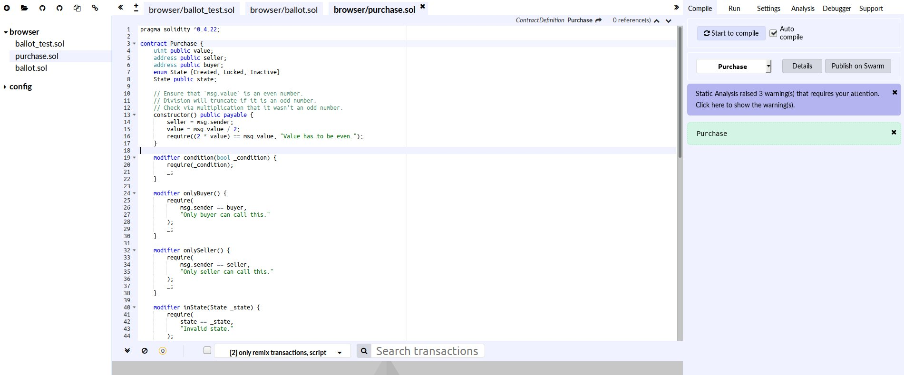
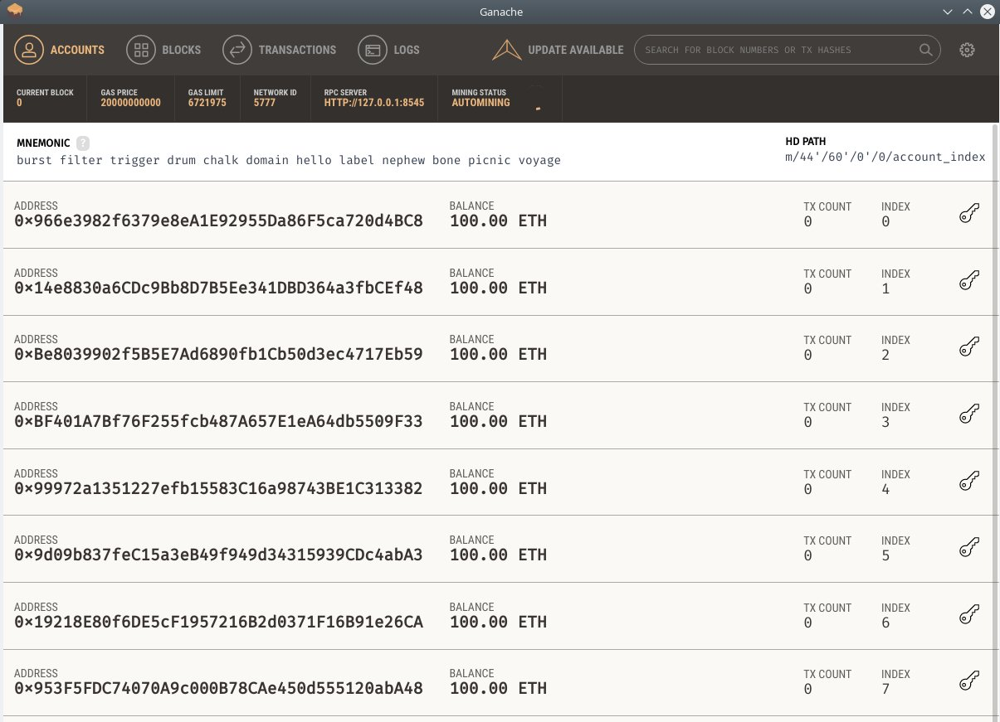
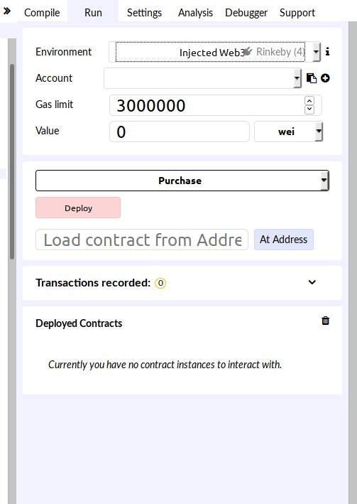

# Setting up you development environment
Here we will learn to setup a really easy to use development environment based on the Remix-IDE and the [Ganache](https://truffleframework.com/ganache) private blockchain client. Installing these two apps is really simple and you can refer to their official docs to learn how to do it on your operating system.

Once started, Remix's interface can be accessed through your browser usually on localhost:8080. this is what it looks like:


From Remix you can open solidity code on your local computer or write your own in the editor. Remix offers automatic compilation of you code as well static code analysis, drawing your attention to potential vulnerabilities of your contract.

Upon starting Ganache, it immediately starts a private blockchain and configures ten initial addresses for you to use on your tests.

We can see that Ganache's private blockchain client is listening for RPC calls on port 8545. Thus to connect Remix with ganache and being able to deploy your contracts on this private blockchain, you must go to the run tab on the remix browser and in the environment pull down menu, choose `Web3 provider`, and give the address of Ganaches RPC server: `localhost:8545`.


You can optionally use Remix's internal javascript client which is useful when you want to use the interactive debugger. 

## Interacting with contracts

Let's take the [Ballot contract](/contracts/Intro-to-Solidity/ballot.sol) as an example, in order to interact with it we first need to deploy it. For that we need to go the `Run` tab in the Remix right panel, and after having connected  with a local private chain, we click the deploy button. Here we find our first challenge: the constructor of the ballot contract needs a argument. which is a list of contract names. However the argument type is `bytes32` therefore you cannot pass an array of strings here. So suppose you first proposal is called *proposal 1* and the second  *proposal 2*, then you first have to encode those names into bytes in order to pass them to the constructor of the contract to deploy it. As an example let's look at a quick Python code to do this:

```python
>>> '0x'+''.join([hex(c).strip('0x') for c in b'proposal 1'])
'0x7726f76f73616c231'
>>> '0x'+''.join([hex(c).strip('0x') for c in b'proposal 2'])
'0x7726f76f73616c232'
```

then the array you will pass to the constructor will look like this:
```solidity
["0x7726f76f73616c231","0x7726f76f73616c232"]
```
