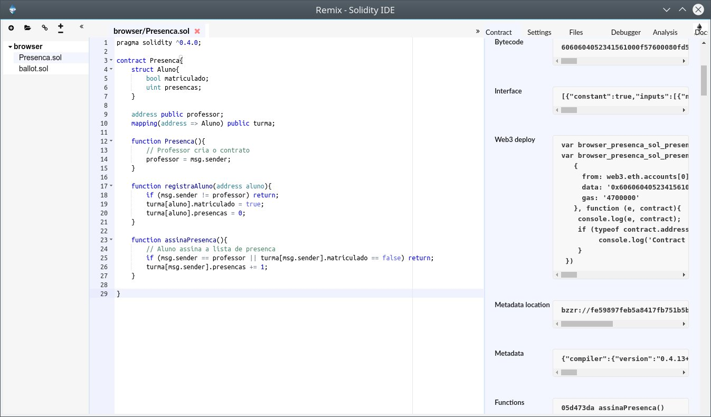

# Introdução à linguagem Solidity

A linguagem **Solidity** é a linguagem padrão para desenvolvimento de *smart contracts*.

Esta linguagem foi concebida intencional mente para ser simples e limitada de maneira a facilitar a análise de contratos
 e tornar os *smart contracts* o mais determinísticos quanto possível.
 
Nós vamos guiar o nosso estudo inicial pela análise de um [contrato](/contracts/Lista_de_Presenca/Presenca.sol) muito simples criado para este curso.

Se você está seguindo este curso, já tem o seu ambiente de desnvolvimento configurado. Abra o *Mist* e a partir do menu *Desenvolvimento* selecione *Open Remix IDE*. Abaixo vai a minha janela do Remix já com um contrato aberto.



O *Remix* é uma IDE muito eficiente para a construção de contratos na linguagem *Solidity*.

## Começando a Programar em Solidity

Vamos começar aos poucos a construir um contrato para servir de registro de presenças em um curso, entre os alunos e o professor.

a Primeira linha de comando que se escreve em um contrato é a seguinte:

```solidity
pragma solidity ^0.4.0;
```

Esta linha basicamente especifica ao compilador qual a versão da linguagem está sendo usada neste programa.

Um contrato na Plataforma *Ethereum* Significa um conjunto de funções e dados que vive em um endereço na blockchain.
Qualquer pessoa que saiba este endereço pode interagir com o contrato, por exemplo, chamando suas funções mas as regras são inteiramente definidas pelo contrato.

Vamos inciar um contrato:

```solidity
pragma solidity ^0.4.0;

contract Presenca{

}
```

A palavra reservada `contract` identifica um bloco de código delimitado por chaves, com um Nome. No caso deste exemplo, o nome é `Presenca`.

